<div align="center">

# 🎭 AI Joke Creator

### Production-Grade Microservices Application with Cloud-Native DevOps

[](https://github.com/Bhardwaj-Saurabh/joke_generator/actions)
[](https://hub.docker.com/u/aryansaurabhbhardwaj)
[](./charts/joke-creator)
[](https://www.python.org/)
[](https://fastapi.tiangolo.com/)
[](./LICENSE)

*A full-stack, production-ready AI application demonstrating modern software engineering practices, cloud-native architecture, and comprehensive DevOps automation.*

[Features](#-features) • [Architecture](#-architecture) • [Quick Start](#-quick-start) • [Deployment](#-deployment-options) • [Documentation](#-documentation)

</div>

---

## 🌟 Features

### 🤖 AI-Powered Generation
- **OpenAI GPT Integration**: Structured joke generation with temperature control
- **Safety Guardrails**: Content moderation and validation
- **Opik Tracing**: Full LLM observability with evaluation metrics

### 🏗️ Production Architecture
- **Microservices Design**: Decoupled Frontend (Nginx) + Backend (FastAPI) + Database (PostgreSQL)
- **Type Safety**: Pydantic models for bulletproof validation
- **Async Operations**: Non-blocking database I/O for high throughput
- **Rate Limiting**: IP-based throttling (5 req/min) via SlowAPI

### 📊 Observability Stack
- **Prometheus Metrics**: Request rates, latency, error tracking
- **Grafana Dashboards**: Real-time visualization
- **Structured Logging**: JSON-formatted logs with correlation IDs
- **Health Checks**: Liveness and readiness probes

### 🚀 DevOps Excellence
- **CI/CD Pipeline**: Automated testing and Docker Hub deployment via GitHub Actions
- **Infrastructure as Code**: Helm charts for Kubernetes orchestration
- **Multi-Environment**: Docker Compose (local) + Kubernetes (staging/prod)
- **Secret Management**: Kubernetes Secrets with encrypted injection

---

## 🏛️ Architecture

```mermaid
graph LR
    User[👤 User] --> LB[⚖️ Load Balancer]
    LB --> FE[🎨 Frontend<br/>Nginx:Alpine]
    LB --> BE[⚙️ Backend<br/>FastAPI + Uvicorn]
    BE --> DB[(🗄️ PostgreSQL 16)]
    BE --> OpenAI[🤖 OpenAI API]
    BE --> Opik[📊 Opik Platform]
    
    subgraph Observability
        BE -.metrics.-> Prom[📈 Prometheus]
        Prom --> Graf[📊 Grafana]
    end
    
    style FE fill:#e1f5ff
    style BE fill:#fff9e1
    style DB fill:#ffe1e1
```



**Tech Stack:**
- **Backend**: Python 3.11, FastAPI, Pydantic, SQLModel, AsyncPG
- **Frontend**: HTML5, Vanilla JS, CSS3 (Glassmorphism design)
- **Database**: PostgreSQL 16 with async SQLAlchemy
- **Observability**: Prometheus, Grafana, Opik
- **Orchestration**: Docker Compose, Kubernetes (Helm), Minikube
- **CI/CD**: GitHub Actions → Docker Hub

📖 [View Detailed Architecture](docs/ARCHITECTURE.md)

---

## 🚀 Quick Start

### Prerequisites
- **Docker Desktop** (includes Docker Compose)
- **Git**

### Option 1️⃣: Docker Compose (Recommended for Testing)

```bash
# Clone the repository
git clone https://github.com/Bhardwaj-Saurabh/joke_generator.git
cd joke_generator

# Configure secrets
cp backend/.env.example backend/.env
# Edit backend/.env and add your OPENAI_API_KEY

# Launch the stack
docker-compose up --build
```

**Access**: http://localhost

**What's Running?**
- Frontend: http://localhost (Nginx)
- Backend API: http://localhost:8000
- Database: PostgreSQL on port 5432
- API Docs: http://localhost:8000/docs

---

### Option 2️⃣: Local Kubernetes (Production Simulation)

Perfect for learning **Helm**, **Kubernetes**, and **Observability**.

#### Step 1: Install Tools
```bash
brew install minikube helm kubernetes-cli
```

#### Step 2: Start Cluster
```bash
# Start local registry
docker run -d -p 5000:5000 --restart=always --name registry registry:2

# Launch Minikube
minikube start --nodes 2 -p joke-cluster --insecure-registry "host.minikube.internal:5000"
```

#### Step 3: Build & Push Images
```bash
# Build images
docker build -t localhost:5000/joke-backend ./backend
docker build -t localhost:5000/joke-frontend ./frontend

# Push to local registry
docker push localhost:5000/joke-backend
docker push localhost:5000/joke-frontend
```

#### Step 4: Deploy with Helm
```bash
helm install joke-app ./charts/joke-creator \
  --set secrets.openaiApiKey="YOUR_OPENAI_KEY" \
  --set secrets.opikApiKey="YOUR_OPIK_KEY"
```

#### Step 5: Access Application
```bash
minikube service joke-app-frontend -p joke-cluster
```

📘 [Full Local Ops Guide](LOCAL_OPS.md)

---

### Option 3️⃣: Manual Development Setup

For active development with hot-reload:

```bash
# Terminal 1: Database
docker run -d -p 5432:5432 \
  -e POSTGRES_USER=user \
  -e POSTGRES_PASSWORD=password \
  -e POSTGRES_DB=joke_db \
  postgres:16-alpine

# Terminal 2: Backend
cd backend
uv sync
uv run uvicorn main:app --reload --port 8000

# Terminal 3: Frontend
cd frontend
python -m http.server 3000
```

**Access**: http://localhost:3000

---

## 🎯 API Endpoints

| Endpoint        | Method | Description                   |
| --------------- | ------ | ----------------------------- |
| `/`             | GET    | Health check                  |
| `/api/generate` | POST   | Generate a joke               |
| `/api/history`  | GET    | Retrieve previous jokes       |
| `/metrics`      | GET    | Prometheus metrics            |
| `/docs`         | GET    | Interactive API documentation |

**Example Request:**
```bash
curl -X POST http://localhost:8000/api/generate \
  -H "Content-Type: application/json" \
  -d '{"topic": "programming", "tone": "witty"}'
```

**Example Response:**
```json
{
  "setup": "Why do programmers prefer dark mode?",
  "punchline": "Because light attracts bugs!",
  "topic": "programming",
  "tone": "witty",
  "is_safe": true
}
```

---

## 🚢 Deployment Options

### Cloud Deployment (Azure)
Deploy to Azure Kubernetes Service (AKS) with Azure Container Registry (ACR).

📖 [Azure Deployment Guide](DEPLOY.md)

### CI/CD Pipeline
Automated testing and deployment via GitHub Actions.

**Workflow**: `Push to master` → `Run Tests` → `Build Images` → `Push to Docker Hub`

View live pipeline: [GitHub Actions](https://github.com/Bhardwaj-Saurabh/joke_generator/actions)

---

## 📊 Observability

### Grafana Dashboards
Access real-time metrics:

```bash
kubectl port-forward svc/monitoring-grafana 3000:80 -n monitoring
```

- **URL**: http://localhost:3000
- **User**: `admin`
- **Password**: Retrieved via:
  ```bash
  kubectl get secret -n monitoring monitoring-grafana \
    -o jsonpath="{.data.admin-password}" | base64 -d
  ```

**Available Metrics:**
- Request throughput (req/sec)
- P95 latency
- Error rates
- Database connection pool status

---

## 📚 Documentation

### Core Docs
- 📐 **[Architecture Guide](docs/ARCHITECTURE.md)**: System design, components, and Mermaid diagrams
- ☁️ **[Deployment Guide](DEPLOY.md)**: Azure AKS deployment walkthrough
- 🏠 **[Local Ops Manual](LOCAL_OPS.md)**: Kubernetes local development

### Learning Path (Build It Yourself)
Progressive tutorials to master the stack:

1. 🐍 **[Module 1: Fundamentals](tutorials/01_FUNDAMENTALS.md)** - FastAPI, Pydantic, AI Integration
2. 🐳 **[Module 2: Containers](tutorials/02_CONTAINERS.md)** - Docker, Compose, Nginx, Database
3. ☸️ **[Module 3: Cloud-Native](tutorials/03_CLOUD_NATIVE.md)** - Kubernetes, Helm, CI/CD, Observability

---

## 🧪 Testing

### Unit Tests
```bash
cd backend
uv run pytest tests/
```

### End-to-End Tests
```bash
cd backend
uv run python scripts/e2e_test.py
```

### Load Testing
```bash
# Generate synthetic traffic
cd backend
uv run python scripts/generate_dataset.py
```

---

## 🛠️ Development

### Project Structure
```
joke-creator-py/
├── backend/              # FastAPI application
│   ├── app/
│   │   ├── models.py     # Pydantic schemas
│   │   ├── db.py         # Database layer
│   │   └── services/     # Business logic
│   ├── tests/            # Pytest suite
│   └── main.py           # App entrypoint
├── frontend/             # Static web UI
│   ├── static/
│   │   ├── index.html
│   │   ├── style.css
│   │   └── script.js
│   └── nginx.conf
├── charts/               # Helm chart
│   └── joke-creator/
├── kubernetes/           # Raw K8s manifests
├── docs/                 # Architecture docs
├── tutorials/            # Learning guides
└── docker-compose.yml    # Local orchestration
```

### Code Quality
- **Type Hints**: 100% coverage with Pydantic
- **Linting**: Pre-commit hooks (Ruff/Black)
- **Testing**: 90%+ code coverage

---

## 🤝 Contributing

Contributions welcome! Please follow these steps:

1. Fork the repo
2. Create a feature branch (`git checkout -b feature/amazing-feature`)
3. Commit changes (`git commit -m 'Add amazing feature'`)
4. Push to branch (`git push origin feature/amazing-feature`)
5. Open a Pull Request

---

## 📄 License

This project is licensed under the MIT License - see the [LICENSE](LICENSE) file for details.

---

## 👨‍💻 Author

**Saurabh Bhardwaj**

[](https://github.com/Bhardwaj-Saurabh)
[](https://linkedin.com/in/your-profile)
[](mailto:your.email@example.com)

---

## 🌟 Acknowledgments

- **OpenAI** for GPT API
- **Comet ML** for Opik observability platform
- **FastAPI** community for excellent documentation

---

<div align="center">

**⭐ Star this repo if you found it helpful!**

Made with ❤️ and ☕ | [Report Bug](https://github.com/Bhardwaj-Saurabh/joke_generator/issues) | [Request Feature](https://github.com/Bhardwaj-Saurabh/joke_generator/issues)

</div>
