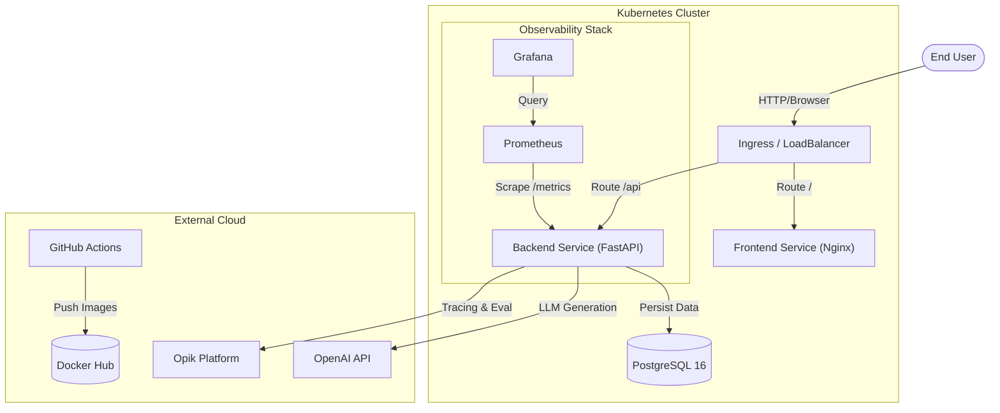
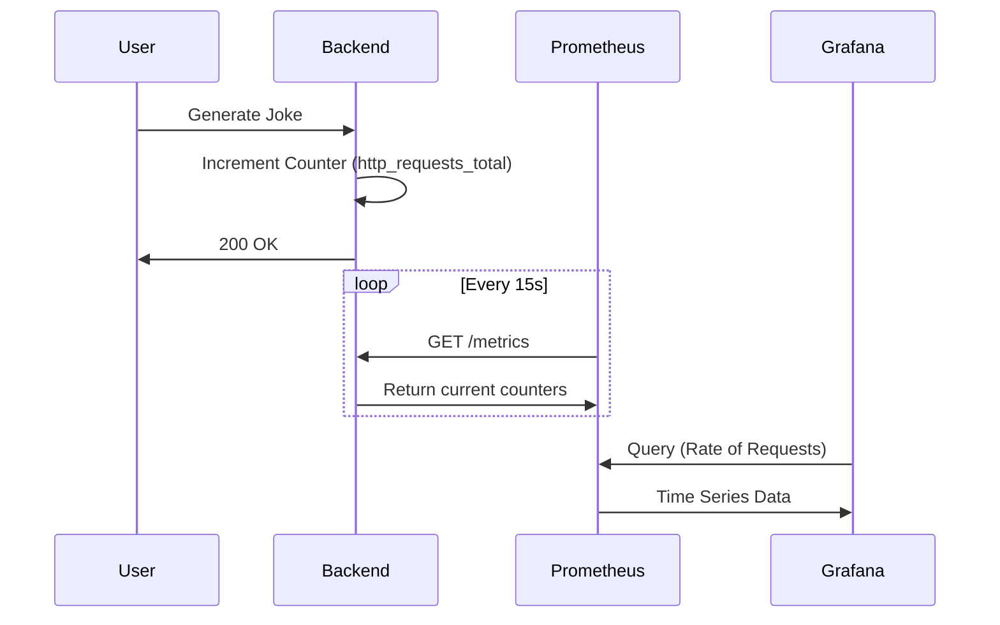

# System Architecture: Joke Creator (Production Grade)

> **Note**: This document describes the architecture of the `joke-creator-py` system as of v1.0.0. To view the diagrams, ensure you have a [Mermaid](https://mermaid.js.org/) viewer installed (or view on GitHub).

---

## 1. High-Level Architecture
The system follows a **Cloud-Native Microservices** pattern, designed for scalability, observability, and separation of concerns.

---

## 2. Component Deep Dive

### 2.1. Frontend Service (`/frontend`)
*   **Role**: Serves the User Interface.
*   **Tech**: HTML5, Vanilla JS, CSS3, Nginx (Alpine Linux).
*   **Responsibility**:
    *   Serves static assets (`index.html`, cached).
    *   Acts as a **Reverse Proxy** to the backend during local dev (via Nginx config) to avoid CORS.
*   **Deployment**: Stateless ReplicaSet.

### 2.2. Backend Service (`/backend`)
*   **Role**: Core business logic.
*   **Tech**: Python 3.11, FastAPI, Pydantic, Uvicorn.
*   **Key Dependencies**:
    *   `openai`: For LLM interactions.
    *   `prometheus-fastapi-instrumentator`: Exposes Prometheus metrics.
    *   `slowapi`: Rate limiting (Security).
    *   `opik`: LLM Tracing.
*   **Capabilities**:
    *   **Input Validation**: Strict typing via Pydantic Models (`JokeRequest`).
    *   **Guardrails**: Checks inputs/outputs for safety before returning.
    *   **Structured Output**: Enforces JSON response from LLM.
    *   **Instrumentation**: Automatic latency and request counting.

### 2.3. Data Persistence Layer
*   **Role**: Permanent storage of generated jokes and metadata.
*   **Tech**: PostgreSQL 16.
*   **Schema**:
    *   `id` (UUID, Primary Key)
    *   `params` (JSONB)
    *   `setup` (Text)
    *   `punchline` (Text)
    *   `latency` (Float)
*   **Access**: Asynchronous via `SQLModel` (SQLAlchemy).

---

## 3. DevOps & Infrastructure

### 3.1. Containerization
We use **Docker** multi-stage builds to ensure small, secure images.
*   **Backend Image**: ~150MB (Python Slim).
*   **Frontend Image**: ~20MB (Nginx Alpine).

### 3.2. Orchestration (Kubernetes)
The application is packaged as a **Helm Chart** (`charts/joke-creator`).
*   **Deployments**: Manages Pod replicas.
*   **Services**: ClusterIP for internal talk, LoadBalancer for external access.
*   **Secrets**: `OPENAI_API_KEY` and `OPIK_API_KEY` are injected securely (never hardcoded).

### 3.3. Observability Pipeline
We have a "Glass Box" approach to monitoring.

---

## 4. CI/CD Pipeline
We use **GitHub Actions** for automated delivery.

*   **Trigger**: Push to `master`.
*   **Steps**:
    1.  **Test**: Runs `pytest` (Unit Tests) with mocked external calls.
    2.  **Lint/Check**: Ensures `uv sync` works.
    3.  **Authentication**: Log in to Docker Hub.
    4.  **Publish**: Build and Push images tagged with `commit-sha` and `latest`.

---

## 5. Security Measures
1.  **Rate Limiting**: 5 requests/minute/IP to prevent abuse.
2.  **Injection Safety**: Pydantic strips dangerous characters.
3.  **Secret Management**: Secrets passed only via Env Vars or K8s Secrets.
4.  **Least Privilege**: Containers run as non-root (where supported) and minimal base images.
